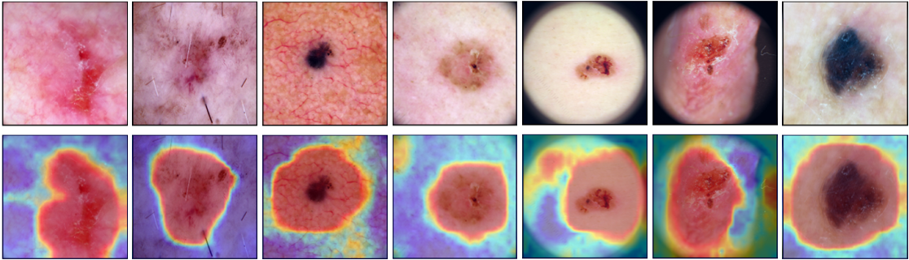

# <h1 align="center">ISIC2019 Skin Lesion Classification</h1>

<h3 align="center">A full skin lesion segmentation and classification pipeline for ISIC2019 dataset.</h3>


Table of Contents
=================

<!--ts-->
   * [Dataset Structure](#dataset-structure)
   * [Skin Hair Dataset](#skin-hair-dataset)
   * [Lesion Segmentation](#lesion-segmentation)
   * [Base Architecture](#base-architecture)
   * [Ensemble Architecture](#ensemble-architecture)
   * [Visualize Attention Maps](#visualize-attention-maps)
   * [Model Training](#model-training)
   * [Inference](#inference)
<!--te-->


Dataset Structure
============
```
.
├── .
├── datasets                      # Dataset directory.
    └── challenge1                # Challenge 1 (Binary) dataset.
        ├── test
            └── testX
        ├── train
            ├── nevus
            └── others
        └── val
            ├── nevus
            └── others
    ├── challenge2              # Challenge 2 (Multi-class) dataset.
        ├── test
            └── testX
        ├── train
            ├── bcc
            ├── mel
            └── scc
        └── val
            ├── bcc
            ├── mel
            └── scc
    └── skin_hairs 
```

Skin Hair Dataset
===============
Hair augmentation is a crutial step that is implemented during the dataset transform/augmentation pipeline. The skin hair was manually augmented from 5 different samples to be used randomly during the augmentation. The segmentation was done manually and the process is summarised in the figures below. To have an access to the dataset, you can find the QR code that will redirect to the Drive download link in the project defense powerpoint in this repository.


Lesion Segmentation
===============
Lesion segmentation is made purely using image processing. The segmentation pipeline can be found in `./utils/segmentation.py` under the class `SegmentMelISIC`. Those lesion masks, even though they are optional in this pipeline, resulted in improvement in the results. The next figure shows some examples of the lesions segmented.


Base Architecture
===============
The base architecture was from an implementation by `Yan, Y., Kawahara, J., & Hamarneh, G. (2019). Melanoma recognition via visual attention. In Information Processing in Medical Imaging: 26th International Conference, IPMI 2019, Hong Kong, China, June 2–7, 2019, Proceedings 26 (pp. 793-804). Springer International Publishing.`. It used VGG16_BN as the base model and introduces attention blocks that can work with/without masks. The next figure demonestrates the architecture that was used as a base model in two of the experiments controllers in this repository work.


Ensemble Architecture
===============
We took it a step further to improve the results obtained from this base model by building an ensemble pipeline that trains using k-fold splits of the datasets, and combine the results using either majority voting or weighted voting. The next figure demonestrates the ensemble approach.


Visualize Attention Maps
==========
We also visualized the attention map using the same approach presented by the author cited previously. To visualize the results, you could either visualize while running the inference by adding a `-gradcam` flag to the command, or in `./notebooks/6_GradCAM_viz.ipynb` notebook.




Model Training
===========
To train the model, you could either run the following command as in the notebooks from a command line, or from a notebook as the developed examples. Take note that this will take extremely long time if GPU doesn't exist.

To train the base model for the binary problem (challenge 1):
```
python ./train.py --train_path "../datasets/challenge1/train" \
            --train_masks_path "../datasets_masks/challenge1/train" \
            --valid_path "../datasets/challenge1/val" \
            --experiment_name "ClassifierSegExperiment" \
            --network_name "VGG16_BN_Attention" \
            --max_epochs "50" \
            --base_lr "0.00001" \
            --batch_size "32" \
            --verbose "2"
```

To train the ensemble for the binary problem (challenge 1):
```
python ./train_cv.py --train_path "../datasets/challenge1/train" \
            --train_masks_path "../datasets_masks/challenge1/train" \
            --valid_masks_path "../datasets_masks/challenge1/val"\
            --valid_path "../datasets/challenge1/val" \
            --experiment_name "ClassifierSegExperimentCV" \
            --network_name "VGG16_BN_Attention" \
            --max_epochs "50" \
            --base_lr "0.00001" \
            --num_folds "5" \
            --batch_size "32" \
            --verbose "2"
```


To train the base model for the multi-class problem (challenge 2):
```
python ./train.py --train_path "../datasets/challenge2/train" \
            --train_masks_path "../datasets_masks/challenge2/train" \
            --valid_path "../datasets/challenge2/val" \
            --experiment_name "ClassifierSegExperiment" \
            --network_name "VGG16_BN_Attention" \
            --max_epochs "50" \
            --base_lr "0.00001" \
            --batch_size "32" \
            --verbose "2" \
            --focal_loss \
            --multi
```

To train the ensemble for the multi-class problem (challenge 2):
```
python ./train_cv.py \
            --train_path "../datasets/challenge2/train" \
            --train_masks_path "../datasets_masks/challenge2/train" \
            --valid_path "../datasets/challenge2/val" \
            --valid_masks_path "../datasets_masks/challenge2/val"\
            --experiment_name "ClassifierSegExperimentCV" \
            --network_name "VGG16_BN_Attention" \
            --max_epochs "50" \
            --base_lr "0.00001" \
            --num_folds "5" \
            --batch_size "32" \
            --verbose "1" \
            --focal_loss \
            --multi
```

Inference
===========
To run the inference on the test set (or the val for validation), you can run the following command lines for both challenges. Adding the flag `--report` will work only when ground-truth (labels) are given for the test (might need to review the inference code as there are slight conditions for the test path). It is useful for validation to generate a report for the inference. It works on both single and ensemble model by the flag `--ensemble`, where this flag (for the ensemble) searchs in the folds directory for the models. For multi-class problem, it is also important to add the flag `--multi`, but must not be added for the binary problem. Finally, to visualize and save the attention maps (from attention map 1 - you can modify the code easily to save attention map 2) from all of the models, you can add `--gradcam` flag.

Also, two combination approaches were developed, both majority voting (default), and weighted voting. To use weighted voting, add the following flag with the value `--combination_strategy "weighted_voting"`.

Take note that the `--timeframe` flag is the folder name for the model experiment run, this must be changed to your folder name once the training is over. An example is shown below.

To run inference on the validation set for the binary class problem (challenge 1):
```
# doesn't save the attention maps visualization, uses majority voting.
python ./inference.py --test_path "../datasets/challenge1/val" \
            --experiment_name "ClassifierSegExperimentCV" \
            --network_name "VGG16_BN_Attention" \
            --max_epochs "50" \
            --base_lr "0.00001" \
            --batch_size "32" \
            --timeframe "2023-12-24_2131" \
            --verbose "2" \
            --ensemble \
            --report
```

To run inference on the validation set for the multi-class problem (challenge 2):
```
# doesn't save the attention maps visualization, uses majority voting.
python ./inference.py --test_path "../datasets/challenge2/val" \
            --experiment_name "ClassifierSegExperimentCV" \
            --network_name "VGG16_BN_Attention" \
            --max_epochs "50" \
            --base_lr "0.00001" \
            --batch_size "32" \
            --timeframe "2023-12-29_0940" \
            --verbose "2" \
            --multi \
            --ensemble \
            --report
```
