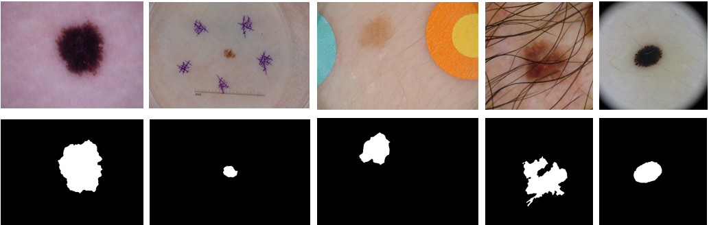
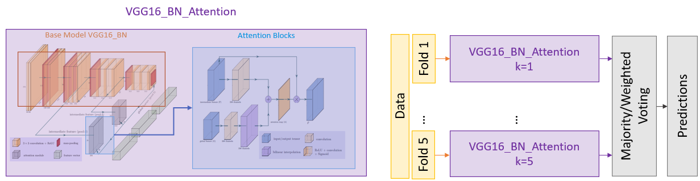

# <h1 align="center">ISIC2019 Skin Lesion Classification</h1>

<h3 align="center">A full skin lesion segmentation and classification pipeline for ISIC2019 dataset.</h3>


Table of Contents
=================

<!--ts-->
   * [Dataset Structure](#dataset-structure)
   * [Skin Hair Dataset](#skin-hair-dataset)
   * [Lesion Segmentation](#lesion-segmentation)
   * [Base Architecture](#base-architecture)
   * [Ensemble Architecture](#ensemble-architecture)
<!--te-->


Dataset Structure
============
```
.
├── .
├── datasets                      # Dataset directory.
    └── challenge1                # Challenge 1 (Binary) dataset.
        ├── test
            └── testX
        ├── train
            ├── nevus
            └── others
        └── val
            ├── nevus
            └── others
    ├── challenge2              # Challenge 2 (Multi-class) dataset.
        ├── test
            └── testX
        ├── train
            ├── bcc
            ├── mel
            └── scc
        └── val
            ├── bcc
            ├── mel
            └── scc
    └── skin_hairs 
```

Skin Hair Dataset
===============
Hair augmentation is a crutial step that is implemented during the dataset transform/augmentation pipeline. The skin hair was manually augmented from 5 different samples to be used randomly during the augmentation. The segmentation was done manually and the process is summarised in the figures below. To have an access to the dataset, you can find the QR code that will redirect to the Drive download link in the project defense powerpoint in this repository.


Lesion Segmentation
===============
Lesion segmentation is made purely using image processing. The segmentation pipeline can be found in `./utils/segmentation.py` under the class `SegmentMelISIC`. Those lesion masks, even though they are optional in this pipeline, resulted in improvement in the results. The next figure shows some examples of the lesions segmented.


Base Architecture
===============
The base architecture was from an implementation by `Yan, Y., Kawahara, J., & Hamarneh, G. (2019). Melanoma recognition via visual attention. In Information Processing in Medical Imaging: 26th International Conference, IPMI 2019, Hong Kong, China, June 2–7, 2019, Proceedings 26 (pp. 793-804). Springer International Publishing.`. It used VGG16_BN as the base model and introduces attention blocks that can work with/without masks. The next figure demonestrates the architecture that was used as a base model in two of the experiments controllers in this repository work.


Ensemble Architecture
===============
We took it a step further to improve the results obtained from this base model by building an ensemble pipeline that trains using k-fold splits of the datasets, and combine the results using either majority voting or weighted voting. The next figure demonestrates the ensemble approach.


